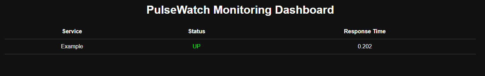

# PulseWatch Monitoring Platform

A lightweight service monitoring system that tracks uptime, response time, and service health.

## Dashboard

## Features

- Automated service monitoring
- Response time tracking
- Background worker
- Live dashboard
- REST API

## Tech Stack

- Python
- FastAPI
- SQLite
- APScheduler
- HTML / JavaScript

## Installation

pip install -r requirements.txt

python -m uvicorn app.main:app --reload

## Dashboard

http://127.0.0.1:8000

## Future Improvements

- authentication
- alert notifications
- uptime analytics
- cloud deployment